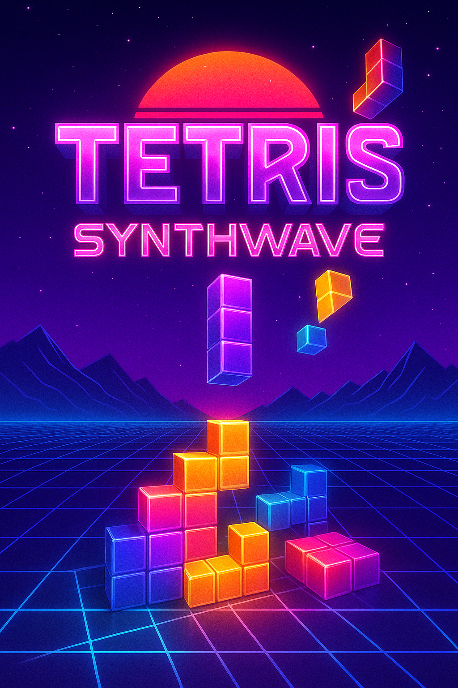
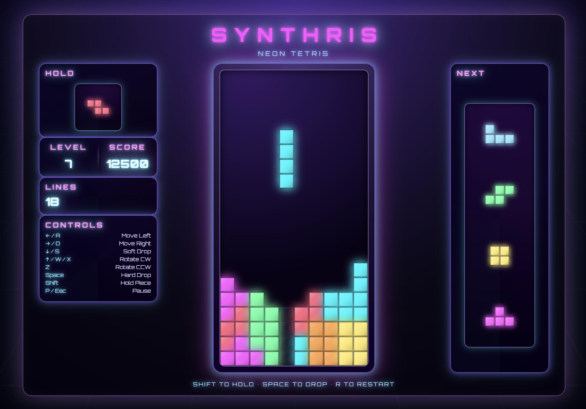
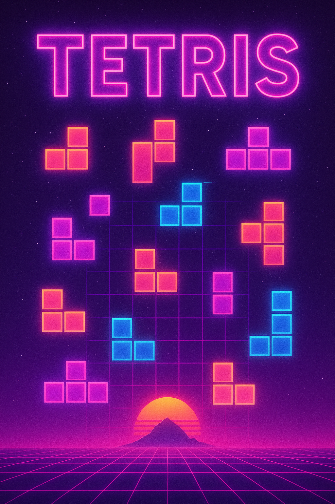

# Synthris – Neon Tetris

A browser-based Tetris remake with a neon synthwave aesthetic, built entirely with vanilla HTML, CSS, and JavaScript. The project pairs classic mechanics: bag-based tetromino spawning, scoring, leveling, line clears, ghost positioning, and a hold queue, with a responsive HUD and glowing presentation.

## Gallery

<table style="width:100%; table-layout:fixed; border-collapse:separate; border-spacing:8px 0; text-align:center; margin:auto;">
  <tr>
    <td style="vertical-align:middle;">
      
    </td>
    <td style="vertical-align:middle;">
      
    </td>
    <td style="vertical-align:middle;">
      
    </td>
  </tr>
</table>


## Features at a Glance

- Standard 10×20 board rendered on `<canvas>` with animated ghost pieces and drop bonuses for soft/hard drops.
- Seven tetrominoes defined with full rotation states and shuffled via a modern “bag” randomizer for fair streaks.
- Shift-triggered hold slot plus a three-piece preview queue, each drawn on dedicated mini canvases.
- Dynamic scoring, line tracking, and level-based gravity that accelerates the drop interval as you progress.
- Pause/game-over overlays with restart shortcuts, plus a responsive HUD showing score, level, lines, controls, and status hints.
- Synthwave styling: neon gradients, star-field grid, Orbitron typography, glowing panels, and futuristic chrome accents.

## Controls

| Action | Keys |
| --- | --- |
| Move | `← / A`, `→ / D` |
| Soft Drop | `↓ / S` |
| Hard Drop | `Space` |
| Rotate Clockwise | `↑ / W / X` |
| Rotate Counter-Clockwise | `Z` |
| Hold / Swap | `Shift` (once per spawn) |
| Pause / Resume | `P` or `Esc` |
| Restart | `R` (also works from the game-over overlay) |

### Hold & Queue Behavior
- Press `Shift` once per spawned piece to either stash it or swap with the held tetromino; the incoming piece always spawns in a clean state at the top.
- The next queue shows the upcoming three pieces; both hold and queue previews use the same neon rendering as the main board.

## Run Locally

1. Clone/download the project and move into the directory:
   ```bash
   git clone <your-fork-or-repo-url>
   cd Tetris
   ```
2. Open `index.html` directly in any modern browser, or serve the folder if you prefer a local web server:
   ```bash
   npx serve .
   # or
   python3 -m http.server
   ```
3. Play immediately: no build tooling or dependencies are required.

## Project Structure

```
.
├── index.html      # Layout skeleton, canvases, HUD, overlays
├── styles.css      # Synthwave visual treatment and responsive layout
├── script.js       # Game loop, input, scoring, hold/queue logic, rendering
└── images/         # Reference screenshots used in this README
```

## Customization Ideas

- Tweak colors/gradients in `styles.css` to explore different retro palettes or add animation to the background grid.
- Adjust timing constants (gravity, lock delay) or scoring values in `script.js` to create new difficulty presets.
- Extend the HUD with stats such as max combo, total tetrises, or leaderboards; the DOM already exposes dedicated panels.

## Credits

Designed and coded by Michael Coulter with guidance from the build prompt in `prompts/Tetris-Creation.md`. Have fun dropping neon tetrominoes!
